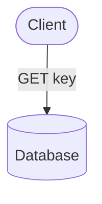

# SchrödingerDB

*Maybe it's there, maybe it's not!*

## Overview

This is a toy project that is designed to be a learning project
for people that I mentor in my company to understand how databases work under the hood.

 ## Architecture

SchrödingerDB is a simple key-value store using a Hash Index.

The database is append-only, meaning that once a key-value pair is written to the database, the data file is never modified.
Hence, challenges like update and deletion arise.

Now, what if we use multiple files (segments) instead of one?
 - What are the challenges?
 - How can we solve them?

Exercise 1: complete the `GET` flowchart

## Features

LOL - it's a toy project, what do you expect?

- [ ] Append-only database
- [ ] Indexing
- [ ] Log file for durability
- [ ] Query language
- [ ] Partitioning
- [ ] Sharding
- [ ] Transactions
- [ ] Replication
- [ ] Clustering