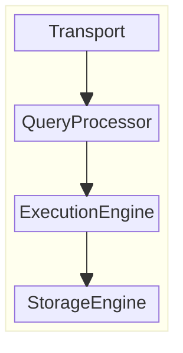

# SchrödingerDB

*Maybe it's there, maybe it's not!*


## Overview

This is a toy project that is designed to be a learning project
for people that I mentor in my company to understand how databases work under the hood.

 ## Architecture

SchrödingerDB is a simple key-value store using a Hash Index.

Like most client-server databases, the following components must be implemented:



## Features

### Writes

The database uses append-only data files, meaning that once a key-value pair is written to the database, the data file is never modified.
Hence, challenges like update and deletion arise.


Now, what if we use multiple files (segments) instead of one?
 - What are the challenges?
 - How can we solve them?

### Reads


Exercise 1: complete the `GET` flowchart


## Roadmap

- [ ] Append-only data files
- [ ] Indexing
- [ ] Log file for durability
- [ ] Query language
- [ ] Partitioning
- [ ] Sharding
- [ ] Transactions
- [ ] Replication
- [ ] Clustering

## Run the app 

To run the project schrodingerDB you will need to have maven and a java SDK installed

```shell
mvn clean compile
mvn test
mvn package
java -jar target/schrodingerdb-<Version>.jar
```