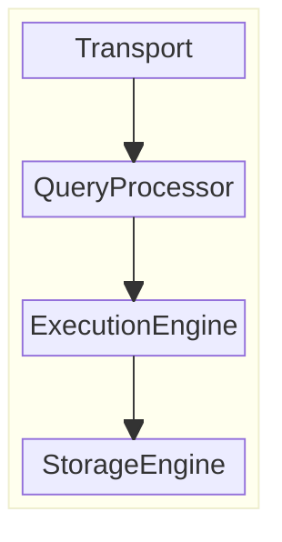
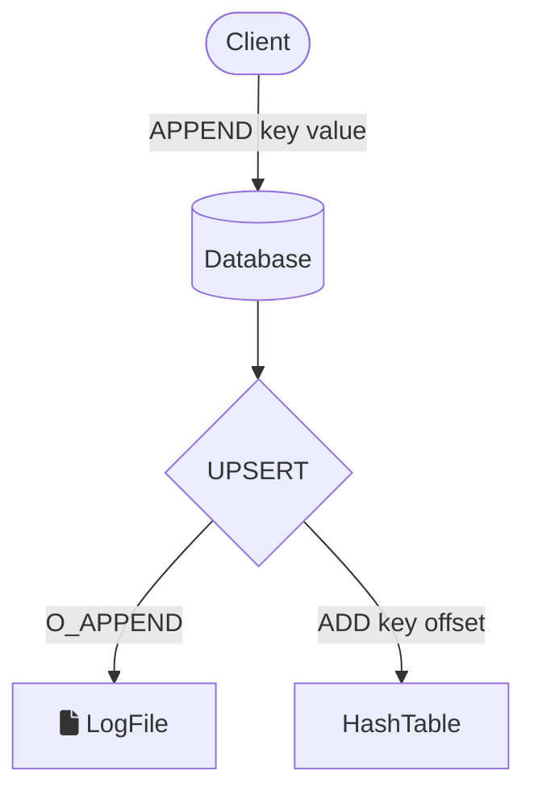
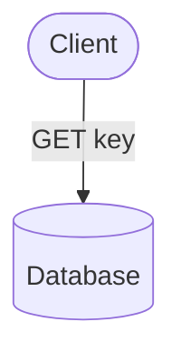

# SchrödingerDB

*Maybe it's there, maybe it's not!*

## Overview

This is a toy project that is designed to be a learning project
for people that I mentor in my company to understand how databases work under the hood.

 ## Architecture

SchrödingerDB is a simple key-value store using a Hash Index.

Like most client-server databases, the following components must be implemented:

### Transport

#### Client communication

The DB must open a client communication port on a TCP port to handle Redis client requests.

#### Cluster communication

No cluster communication is planned for now.

### Query Processor

The query processor is responsible for parsing, validating and interpreting queries.
No RBAC will be implemented, so no access checks need to be performed afterward.

The DB will leverage [RESP](https://redis.io/docs/latest/develop/reference/protocol-spec/) (Redis serialization protocol) because
this protocol is well documented, and we will be able to use a simple REDIS CLI to test the DB.

Regarding the version, [RESP2](https://github.com/redis/redis-specifications/blob/master/protocol/RESP2.md) is enough for our limited use case.

#### Query Parser

The DB should accept a limited subset of Redis/Valkey queries.
A query planner is not required as the DB only supports point queries based on a single index.

#### Query Optimizer

No query optimizer is required as queries will be basic and straightforward.

### Execution Engine

#### Local Execution

#### Remote Execution

No remote execution is planned for now.

### Storage Engine

**Constraint**: The storage engine must be pluggable. Even if there is a single canonical implementation, a pluggable architecture allows developer to mock the storage engine during tests (spy, fault injection, ...).

#### Transaction Manager

No required for now. If we want to implement a Transaction-capable database, then using FoundationDB seems to most interesting option.

### Lock Manager

We may want to implement a limited concurrency control mechanism.

#### Storage Structure Manager

This component is the one on which we will focus on. It organizes data on disk and manages data retrieval.

#### Buffer Manager

This component should maintain a cache of data pages.

#### Recovery Manager

A basic recovery manager should be implemented, not all edge cases will be covered.

## Features

### Writes

The database uses append-only data files, meaning that once a key-value pair is written to the database, the data file is never modified.
Hence, challenges like update and deletion arise.

Now, what if we use multiple files (segments) instead of one?
 - What are the challenges?
 - How can we solve them?

### Reads

Exercise 1: complete the `GET` flowchart

## Roadmap

- [ ] Append-only data files
- [ ] Indexing
- [ ] Log file for durability
- [ ] Query language
- [ ] Partitioning
- [ ] Sharding
- [ ] Transactions
- [ ] Replication
- [ ] Clustering
